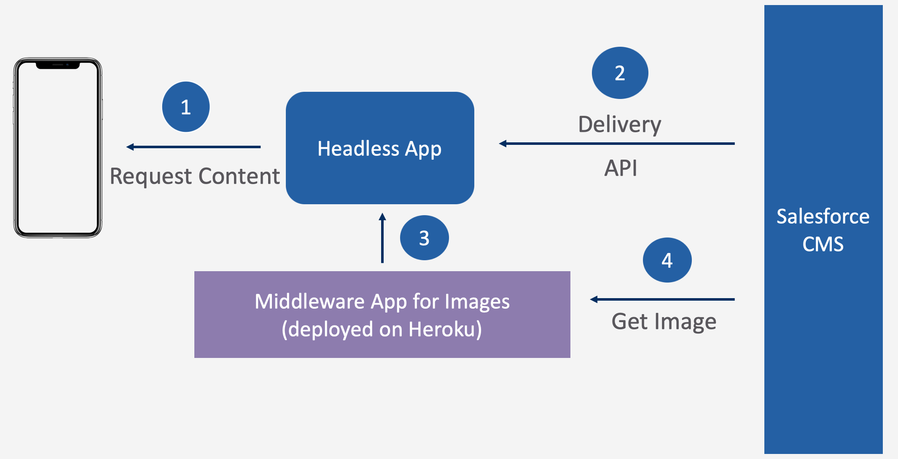

# Purpose

This sample integration with CMS is to relize the impact & power of connected experiences. With Commerce 20.2 release, you can access the CMS content in the Commerce Storefront via [Page Designer](https://help.salesforce.com/articleView?id=b2c_20_2_pagedesigner.htm&type=5)  & with this CMS integration, the same content can be accessed in Commerce Headless Application.

This integration will also serve as a sample integration, which you can use for your own learnings or as a starting point for the custom integrations that you may be working on.
This follows the recommended design principles, as explained in [Customization Documentation](https://github.com/SalesforceCommerceCloud/sfcc-sample-apps/blob/master/docs/componentExtension.md).

But please note, this is only a sample implementation & will certainly require modifications/updates before can be used in real customer engagements. These modifications may be related to Security or Governance policies(Authorization/Authentication/Monitoring or governance aspects) or could be related to customer custom needs. Implementations based on this sample extension, should be completely owned & tested by the Partner/Customer. 

# Architecture Overview

The content is accessed from CMS via the [Delivery APIs](https://developer.salesforce.com/docs/atlas.en-us.224.0.chatterapi.meta/chatterapi/connect_resources_managed_content_resources.htm).

This integration is inline to the native CMS & Commerce integration which relies on the CMS 'Content Type' while designing the Page Designer custom components.

From Headless Appllication, [Channel API](https://developer.salesforce.com/docs/atlas.en-us.224.0.chatterapi.meta/chatterapi/connect_resources_managed_content_delivery_channel.htm) is used to get the content of a given Content Type. Content Type & the ID of the content is required while usign this API.

CMS returns the content, the content structure is inline with the Content Type. The images are not available on public URL(as of now), so a different API call is required to get the images. The relative path of the image, is returned in the Delivery API response, which then is used in the second API call to get the image.

#### Prerequisites:
1) You need to have a Salesforce Org, with CMS Application.
2) Configire a Connected App in this Salesforce Org to access the data from Headless Application.

## Tech Stack



### Code/Config details

Following are the high level steps involved while extending sample Headless Application:


#### Update the workspaces -> packages in package.json
CMS integration requires you to create a new package, update the newly created "packages/cms" in packages.

#### Update the api.js to include the additional configurations for CMS
If you already have a working api.js file(which holds the config for the application), then please review the new api.example.js - it has additional configs which are required by this CMS itegration.

Copy the additional configs from example file & create these new configs in your existing api.js & provide the details.
If you do not have a working api.js then follow the instructions in the main Read me file & configure api.js file.

New attributes added:
```
const CMS_GRANT_TYPE = 'password';
const CMS_CLIENT_ID = 'Client ID of the connected App';
const CMS_CLIENT_SECRET = 'Client Secret of the connected App';
const CMS_USERNAME = 'Integration users username';
const CMS_PASSWORD = 'Integration users password';
```

#### Create GraphQL TypeDef & Resolvers
All the external integrations needs to be implemented using the Apollo GraphQL. For that we need to provide the TypeDefinitions & Resolvers.

TypeDefs defines the structure of the data which Resolvers provides the implementation for calling the external systems.

For more details, please review:
- packages/cms/api/schema/cmsResolvers.js
- packages/cms/api/schema/cmsTypeDefs.js

Once the TypeDefs & Resolvers are defined, these needs to be registered with the GraphQL Service as Extensions.
For that, each extension has to use the core.registerExtension heler method & provide the required details. Please review cmsapi.js(packages/cms/cmsapi.js) for details.

#### Call cmsapi.js at server start
Update the sample-app.js to import cmsapi.js -- this is to execute the code in cmsapi.js at the time of server start up. The code in cmsapi.js basically registers the CMS extension with Core GraphQL Service.

#### Changes required in LWC
The frontend of sample Headless Application is LWC driven, hence in order to display the CMS content we need to write some LWC code.

First of all, we need to create a new page(this example implementation uses a new page to show CMS content), for that we need to define a new route in storefront.html

```
<lwce-route path="/cmsContent/:contentType/:contentId">
    <commerce-cmsContent></commerce-cmsContent>
</lwce-route>
```

- Then create a JS to call & handle the response from CMS service, review packages/storefront-lwc/src/modules/commerce/cmsContent/cmsContent.js
- Create a HTML to display the CMS content, review packages/storefront-lwc/src/modules/commerce/cmsContent/cmsContent.html
- Define the query for GraphQL extension -- this is the query which is used in cmsContent.js to call the CMS API, review packages/storefront-lwc/src/modules/commerce/cmsContent/gqlQuery.js